# Heterogeneous computing - modeling for the GPU


> "the typical adult human body consists of about **30 trillion** (3.0·10<sup>13</sup>) human cells and about **38 trillion** (3.8·10<sup>13</sup>) bacteria" - Sender R, Fuchs S, Milo R., Revised Estimates for the Number of Human and Bacteria Cells in the Body, PLoS Biol. 2016 Aug 19, PMID: 27541692

It is clear that for many domains, we cannot afford to leave silicon performance on the table

This series of project experiments with the main parts of modern heterogeneous computer systems. The main goal was to examine the relevant abstractions, performant use cases and limitations, along with limitations and best practices.

Popular specifications, runtimes and libraries were examined too, as these greatly broaden modeling capabilities of modern software.

Using (general-purpose) CPU to its fullest has a great impact on performance, but for the most demanding of use cases, specialized hardware is required. Some commonly seen examples these days are:

- GPUs - highly parallelized processors, used for matrix operations, often in 3D graphics and machine learning

- Floating-point Processing Units (FPUs) - circuits specialized to execute floating point math

- Digital Signal Processors (DSPs) - specialized instructions and large accumulator registers for numeric algorithms (fold/reduce/accumulate, transform/map)

- Embedded Processors - usually packaged with various sensing, actuating and communication peripherals, all the while minimizing energy consumption, and often providing real-time guarantees

## Contents

1. Anatomy of a GPU

2. OpenCL

3. CUDA wrapped in Python

4. Quids - cuPy enabled microorganism simulation

Analysis of CPUs and FPGAs can be found in the neighboring `HPC - CPU` and `GPC - FPGA` repos.

---

## Anatomy of a GPU

What if instead of a quick periodical function, like we had with CPU or DPS processing, we have a N independent tasks which can be executed in parallel? That's where the GPU comes in.

GPUs can store structures of data, process them like a stream, then pass them back to the CPU. The <u>stream processing</u> part means operations on the GPU are vectorized: multiple <u>execution resources/units</u> are grouped together into a <u>SMSP</u> and all operate in parallel, executing a single instruction on many pieces of data at the same time (‘Single Instruction Multiple Data’ or ‘SIMD’).

Varying mounts of <u>SMSPs</u> are grouped into a <u>Processing Element</u>, also called "streaming multiprocessor" (SM) by Nvidia, workgroup processor (WGP) by AMD and OpenCL. Each of the following resource units can vary freely in ratio from the others inside a SMSP:

- FP64 (FMA), FP32 (FMA), FP16 (FMA)

- Int32 Add, Int32 Mul

- lower-bitwidth "packed" integer operations

- RCP (1/x), RSQRT (1/ sqrt(x))

- tensor cores (matrix-multiplication units)

- ‘LD/ST’ execution units perform ‘loads’ and ‘stores’ from and to memory.

- Like CPUs, they have hardware-managed multi-level caches, and entire [files of registers](https://en.wikipedia.org/wiki/Register_file)

Let's have a look at an Nvidia Ampere GPU as an example:

5 **execution resources/units**: 2 INT32 units, 2 FP32 units, 1 FP64 unit (Nvidia advertises as 4 CUDA cores, because on Ampere, the INT units can execute either FP32 or INT32. That's why "CUDA" is rarely mentioned outside of marketing purposes)


1 processing block == **SMSP** ("SM sub-partition"), 16+16+8 execution units, 1 block (tensor core), executing in lockstep, sharing a L0 cache

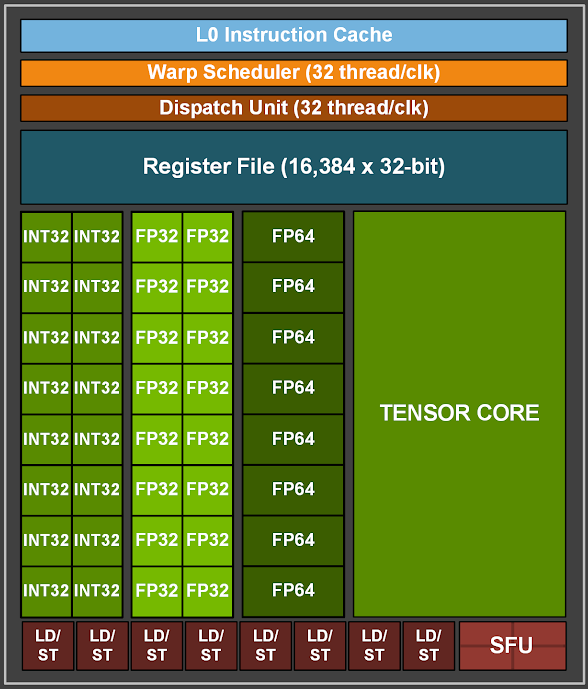

1 **Streaming Multiprocessor**, partitioned into four identical SMSPs, sharing a L1 cache ("a SM with 64 CUDA cores and 4 warp schedulers means that each SMSP/warp scheduler actually only has 16 CUDA cores" [source](https://forums.developer.nvidia.com/t/how-the-16-int-cores-in-a-processing-block-in-sm-execute-when-32-integers-in-a-warp-is-calculated/259827))

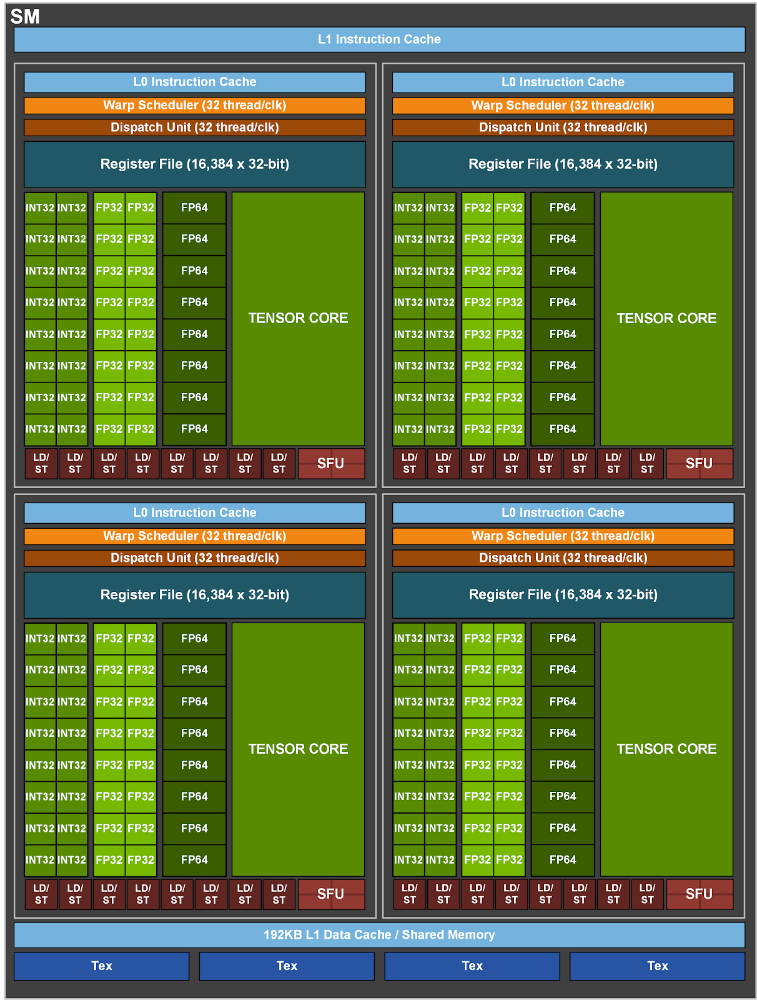

A GPU chip, with 64 SMs (each with 2xSMSP), sharing a L2 cache

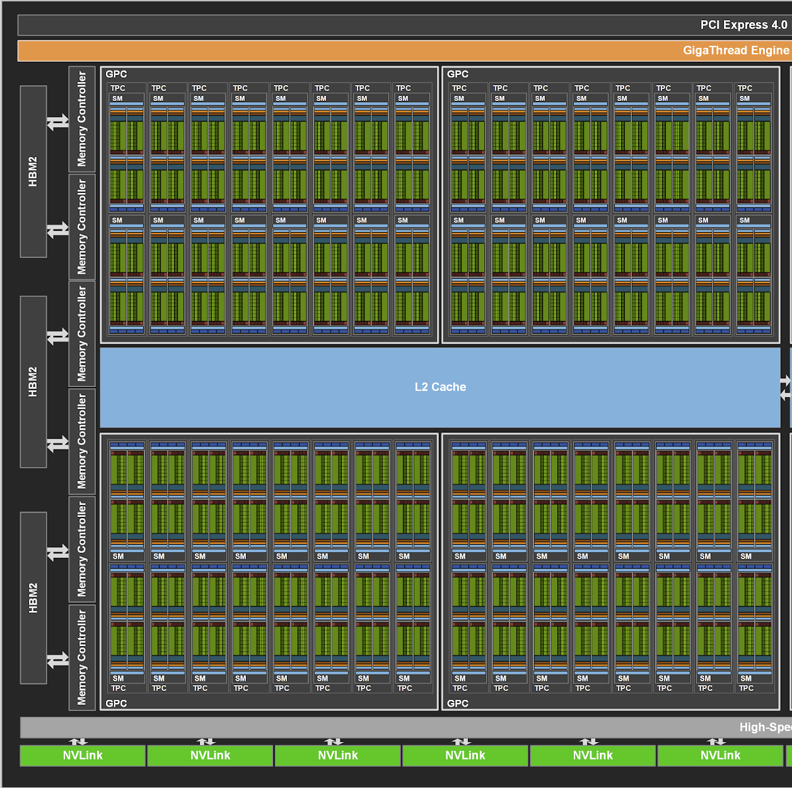

Processing Elements do not implement features seen in CPUs like branch prediction or out-of-order execution, but avoiding that complexity frees up space to squeeze in more of these processors on a single silicon die.

They can however switch between programs very efficiently.

<sup>[⌃ Go back to top ⌃](#contents)</sup>

### Anatomy of GPU software

In the software world, Nvidia uses different terms: grid → blocks → warps → threads

- One block is given to a SM. ([source](https://forums.developer.nvidia.com/t/how-the-16-int-cores-in-a-processing-block-in-sm-execute-when-32-integers-in-a-warp-is-calculated/259827))

- Warps in that block are statically assigned to SMSPs in that SM

- Warps contain threads, but warps themselves are a closer equivalent to CPU threads, since SMSPs execute them in lockstep, and have one shared state (single PC, SP, SR...)
  
     - i.e 32 threads per warp (optimization decision, AMD does 64) all execute an instruction each clock. This is why we talk about a "warp instruction", which could be e.g. 32 INT32 additions in 1 cycle
  
     - so a 4 SMSP SM can execute 128 additions per cycle. If 128 threads contain 1024 INT32 instructions each, all 128 would be completed after 1024 cycles

- Suppose NVIDIA had chosen
  
     - 4-thread warps: 8x more status registers per SMSP, 8x more scheduling decisions - hardware becomes much more expensive
  
     - 256-thread warps: 256 instructions per clock, but only 64 FP32 lanes: each warp takes longer, and *divergence* becomes painful: if 128 threads take if-path in the kernel, and 128 else-path, half the warp sits idle during each branch path

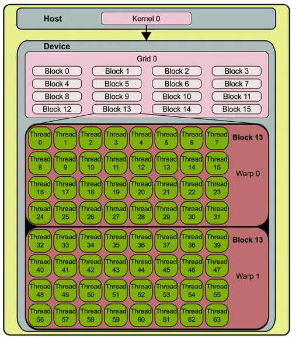

Let's say we are doing a matrix multiplication, with dim=1024 - 1024*1024 row&col combinations, with 1024 mul&add operations per combination

- we could launch 1 thread per combination (each thread does 1024 operations), by e.g. putting 16x16 threads in a warp, resulting in 64*64 blocks in the complete grid (so 256 threads in 4096 blocks)

- warps are usually 32 threads -> each block splits into 8 warps

- let's say 1 SM can work on 64 warps at a time (limited by itself, and additionally by register file size, since each thread has local variables) -> 8 blocks at a time (2048 threads)

Optimal block size is an art ([source](https://www.reddit.com/r/CUDA/comments/x2f767/how_does_cuda_blockswarps_thread_works/)):

- We want to keep thread memory usage quite small, so a lot of warps can fit in a SM, allowing SMSP warp schedulers to keep execution units occupied. (called "***high occupancy***").
  
     - But we do not want blocks too small, because then they are done quickly and new ones need to be fetched to the SM, so memory latency becomes a problem. It's better if a warp is a little bigger because while it waits for new data, it can be efficiently swapped for an another ready warp.

- Threads which need a lot of local variables (registers), or share variables among each other (cache, shared memory), might use up SM resources quickly, meaning not many blocks can fit in an SM (called "*low occupancy*")
  
     - But this **shared data** might really benefit the algorithm (think DP algorithms)

- So what to do? Totally depends on the application/algorithm/data! It's worth writing your code so that it's easy to **experiment and find the best value for your particular kernel**.

Some advice is pretty universal though:

- you almost always want block sizes (amount of threads in them) that are **multiples of 32**. For example: `blockDim.x = 100` creates 3 full warps (96 threads) and 1 partial warp (4 threads), but that last warp still occupies a full warp slot (SMSP) even though only 4 arithmetic lanes are useful.

- And you want operations which do lots of maths on the same data - to maximize **arithmetic intensity**:
  
     - Suppose each thread does: C[i] = A[i] + B[i]; - that's 2 loads, 1 store for just 1 add - arithmetic units are mostly idle, and waiting for data.

- **memory coalescing**: if we make the GPU partial sum a matrix such that each thread takes elements
  
     - with an offset (0:0,1,2,3, 1:4,5,6,7...), that means each threads needs a new cache line each cycle - bad.
  
     - If we make them do a stride: (0:0,4,8,12, 1:1,5,9,13...), 1 cache line feeds multiple threads - memory access coalesced ([source](https://stackoverflow.com/questions/5041328/in-cuda-what-is-memory-coalescing-and-how-is-it-achieved))

<sup>[⌃ Go back to top ⌃](#contents)</sup>

### GPUs in their own world

To understand why only some problem solving approaches are considered viable with accelerators, we can also talk about what GPUs <u>cannot</u> do, given the limitations on what memory they see, their architecture and supported instructions:

- Anything requiring operating-system services (files, threads, sync primitives)

- GPUs cannot throw exceptions (at all, or heavily restricted, as exception unwinding requires substantial runtime support), or use other standard library facilities written assuming a host-only (CPU) environment, like std::locale or std::regex, or are loaded in RAM and inaccessible to the GPU (not because they're impossible in principle, but because nobody implemented a device version)

- Some components are only partially supported: dynamic memory, RTTI, virtual dispatch, recursion, function pointers

The limitations might not manifest during kernel compilation either, but also during loading or launching. For instance, exceeding GPU's resource limits (registers, local memory, shared memory) will fail just like a `malloc` would.

<sup>[⌃ Go back to top ⌃](#contents)</sup>

### Common do's and don'ts

Putting all of that together, we get a set of some broad advice:

| Do                                                                                         | Why                                                                                                                                          |
| ------------------------------------------------------------------------------------------ | -------------------------------------------------------------------------------------------------------------------------------------------- |
| Operate on **value-semantic** data, ideally fixed-size and constant                        | Easier for compiler and hardware                                                                                                             |
| Operate primarily on **arrays**, vectors, matrices/tensors etc.                            | Sequential memory access maps naturally to GPU parallelism and maximizes throughput                                                          |
| Keep **kernels pure** and side-effect-light, and their state small and loops minimal       | Easier to parallelize and optimize, while fitting in limited accelerator registers files and local memory                                    |
| Use simple **arithmetic and numerical algorithms**                                         | GPU hardware is optimized for methods like: map, reduce/fold, filter, scan (partial sum), scatter & gather, sort, search                     |
| Keep **Arithmetic intensity** high: expose **lots of parallel work**, but minimize overlap | Thousands of non-synchronized threads, with high number of operations performed per word of memory transferred, are needed to saturate a GPU |
| Keep GPU thread memory access-cache friendly, with **tiled access patterns**               | Same reasons as with CPUs - cache fetches blocks, we should take advantage of those                                                          |
| **Profile and measure** to find optimal block size                                         | GPU performance is often unintuitive                                                                                                         |

Common "don'ts":

| Don't                                                                                      | Why                                                                                                                                                                                                                                                                                                                   |
| ------------------------------------------------------------------------------------------ | --------------------------------------------------------------------------------------------------------------------------------------------------------------------------------------------------------------------------------------------------------------------------------------------------------------------- |
| Use file or console I/O (`std::cout`), OS synchronization primitives (`mutex`), exceptions | Often impossible, unsupported or heavily restricted                                                                                                                                                                                                                                                                   |
| Create threads (`std::thread`)                                                             | GPU execution model is what provides parallelism                                                                                                                                                                                                                                                                      |
| Allocate memory repeatedly inside kernels, or use deep recursion                           | Dynamic and stack memory is limited in size                                                                                                                                                                                                                                                                           |
| Use complex pointer-heavy data structures, or rely on virtual dispatch in hot code         | Poor memory access patterns, and can inhibit optimization                                                                                                                                                                                                                                                             |
| Launch tiny amounts of work, or transfer data CPU <-> GPU excessively                      | PCIe and memory transfers are often the bottleneck, so GPU launch overhead may dominate                                                                                                                                                                                                                               |
| Create data dependencies and barriers                                                      | A *stalled warp* occupies SM memory, but does not work while waiting for an another block, which might not even be running. And you have to use *cooperative groups* just to avoid potential deadlocks. ([source](https://stackoverflow.com/questions/10460742/how-do-cuda-blocks-warps-threads-map-onto-cuda-cores)) |
| Put if-s in kernels                                                                        | Some threads take if-path, some-else (*divergence*), yet entire warps execute in parallel, so some results need to be discarded                                                                                                                                                                                       |

```cpp
// Thousands of tiny kernel launches...
for (std::size_t i = 0; i < 1'000'000; ++i)
{
    launch_kernel();
}

// are often much slower than:
launch_one_large_kernel();


// Similarly:
for (...)
{
    copy_to_gpu();
    launch_kernel();
    copy_from_gpu();
}

// is frequently far slower than:
copy_to_gpu_once();
launch_many_kernels();
copy_from_gpu_once();
```

Additional complications:

- Most code needs to use both CPU and GPU, not just one. And you generally need different data structures for CPU and GPU (e.g. row major vs column major dense matrix ordering). Or even if the same conceptual structure is used on both, like a Tree, GPUs will likely need a special [flat implementation](https://en.wikipedia.org/wiki/Sparse_voxel_octree).

- Different vendors' GPUs have little differences, some have a certain optimization functionality, some don't, so you cannot easily use it in a general vendor-agnostic code.

- While you might be able to compile your CPU-designed code directly, the performance will be abysmal since GPUs resources are not optimally utilized.

<sup>[⌃ Go back to top ⌃](#contents)</sup>

---

## OpenCL

What if we have a computer system with various processing units: central, graphic, signal-processing, configurable (FPGA), all of which might help execute a single program? Could one program somehow utilize all of them, where it's most appropriate?

### Purpose

As heterogeneous computing is become more common, due to the memory wall, ILP wall, and the power wall ([wiki](https://en.wikipedia.org/wiki/Multi-core_processor#Technical_factors)), ISO-standardized, vendor-agnostic, cross-platform, non-graphics focused "languages/libraries/frameworks" for **General-purpose computing on graphics processing units**, and other coprocessors, is becoming increasingly important, especially in data-intensive domains. This projects explores the area starting from the [GPGPU wiki article](https://en.wikipedia.org/wiki/General-purpose_computing_on_graphics_processing_units).

One note on terminology. It appears no single word has effectively described describe the tools discussed here. Some are standards coupled with implementations of those standards. Some are often called 'frameworks', othes 'platforms'. The word "framework" is mostly used from here on out.

Taken straight from the OpenACC wiki page: "[OpenACC] is designed to simplify parallel programming of [heterogeneous](https://en.wikipedia.org/wiki/Heterogeneous_computing "Heterogeneous computing") systems. As in OpenMP, the programmer can annotate C, C++ or Fortran source code to identify the areas that should be accelerated, using [compiler directives](https://en.wikipedia.org/wiki/Compiler_directives "Compiler directives") and additional functions. Like OpenMP 4.0 and newer, OpenACC can target both the CPU and GPU architectures and launch computational code on them"

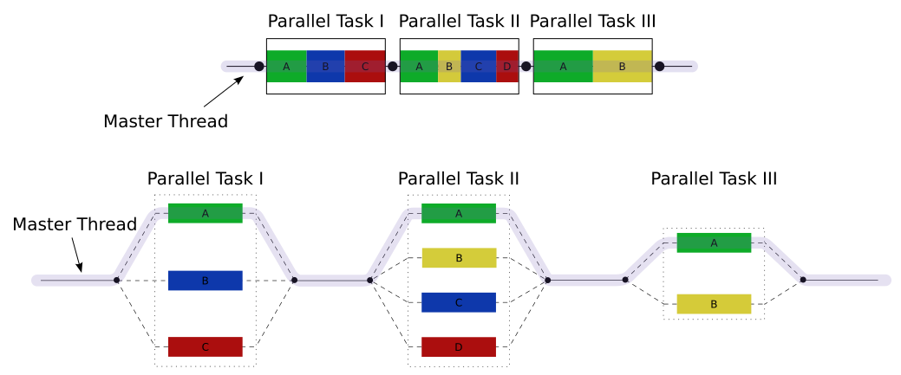

While initially differing in scope and specialization, today we have a [range](https://en.wikipedia.org/wiki/List_of_concurrent_and_parallel_programming_languages#APIs/frameworks) of such frameworks which largely converged in structure and capabilities, including:

- CUDA - unlike the others it's specialized for just Nvidia GPU offload, but follows a similar structure a syntax

- HIP - similar to CUDA, but works on both AMD and Nvidia GPUs

- OpenCL - more general parallels model, not strictly focused on GPUs
  
     - not to be confused with computer vision library OpenCV

- OpenMP

- OpenACC

- SYCL - sits on top, and provides higher-level programming model, to the frameworks listed above

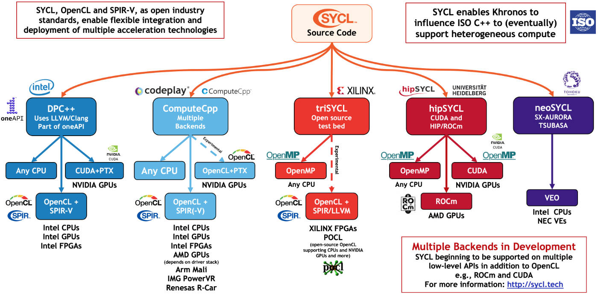

<sup>[⌃ Go back to top ⌃](#contents)</sup>

### Physical architecture

From a physical architecture perspective, these frameworks roughly consist of:

- **Shared memory, execution and device model**, which the developer is expected to know since they set:

- **[Environment] variables** (`OMP_NUM_THREADS`), through which compiled behavior can be finetuned according to available hardware and specifics of the numerical problem, which itself is described using:

- **Compiler directives** (`#pragma omp ...`), enabling the programmer to expresses parallel work in terms of the execution and memory abstractions using C/C++ source code, which instead compiles to calls to:

- **Runtime** (`omp_get_num_threads()`), with functions declared in host-side headers like `omp.h` and implemented in the framework binaries, which will
  
     - vectorize, create threads
  
     - employ locking mechanism
  
     - manage tasks, handle reductions
  
     - offload to the GPU etc.

- There is also the **kernel language**, describing syntax&semantical rules, additionally governed by the execution and device models. This language is used to write device-side *kernels* (stream functions executed in parallel by the GPU), which will be compiled separately, by a:

- vendor-supplied **kernel compiler**

These frameworks usually depend on vendor supplied device drivers, which enable the runtime code to actually use the physical device.

Some frameworks just contain specific layers: SYCL for instance delegates to e.g. OpenCL.

SYCL have made a nice graphic for the physical architecture ([source](https://www.khronos.org/blog/sycl-2020-what-do-you-need-to-know)):

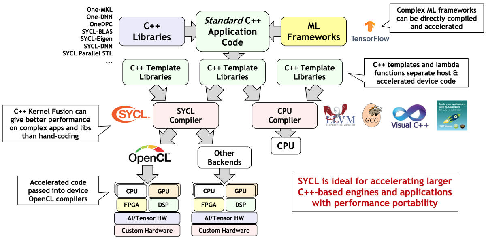

<sup>[⌃ Go back to top ⌃](#contents)</sup>

### Execution

As these frameworks usually sit between the developer and compiler, the usual runtimes (libstdc++, libc++) and the OS might know nothing about OpenMP itself. It just sees code creating threads, mutexes and shared memory. Same for the GPU drivers: they will receive requests to launch kernels, allocate memory or copy buffers, but do not know how those requests came to be.

In other words, when you compile your source code with e.g. `g++ -fopenmp`, the compiler parses the OpenMP directives, transforms the code into calls to the OpenMP runtime, which itself uses other system runtimes and OS memory functions just as vanilla code would. The kernel specification, in C/C++ or some other language is compiled separately, while the main code runs on the CPU and controls key aspects of the operation of the GPU including:

- Transferring compiled kernel code to the GPU;

- Specifying how the GPU runs which kernels and when;

- Transferring data between the CPU and the GPU;

One exception is memory management: today, GPUs go through OS drivers (`DRM/KFD` on Linux, `WDDM` on Windows), because they aid with robustness, scheduling, and virtualization of video memory: allowing video data to be [paged out](https://en.wikipedia.org/wiki/Paging "Paging") of video memory into system RAM. This is acknowledged by GPGPU frameworks (with concepts like "[Unified] Shared/Virtual Memory"), and means OS becomes more involved because CPU and GPU memory management must be coordinated.

<sup>[⌃ Go back to top ⌃](#contents)</sup>

### Solving problems

Certain problems can take advantage of various accelerators, with a speedup potential outweighing GPGPU framework kernel limitations and housekeeping costs of using accelerators.

Parallel programming itself is a discipline both wide and deep. A chapter from *Intermediate Parallel and Distributed Computing*, hosted [here](https://www.learnpdc.org/IntermediatePDC/1-PDCPatterns/PatternsIntro.html), provides a nice flowchart what options a programmer might consider:

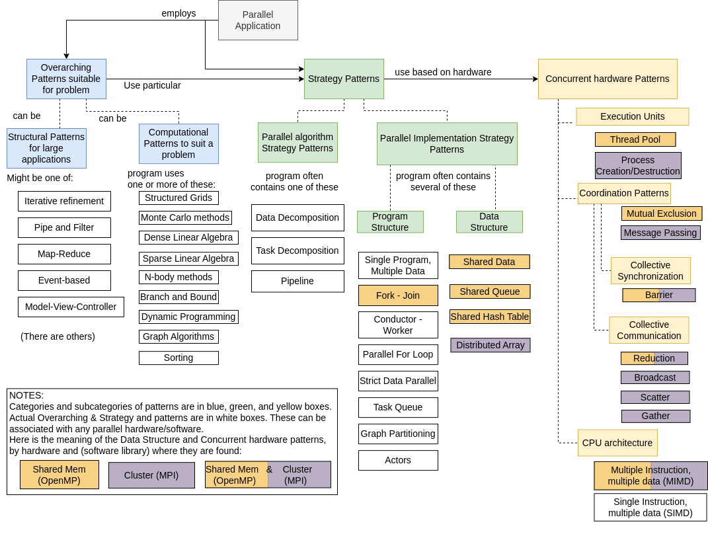

<sup>[⌃ Go back to top ⌃](#contents)</sup>

### Template

A stripped-down example of a host program and device kernel are provided in `./opencl/openclTemplate/template.cpp`.

It follows the canonical OpenCL 1.x workflow:

Device prep:

1. `clGetPlatformIDs()` → discover platforms.
2. `clGetDeviceIDs()` → discover GPU devices.
3. `clCreateContext()` → create execution context.
4. `clCreateCommandQueue()` → create command queue.

Kernel and buffer prep:

1. `clCreateProgramWithSource()` + `clBuildProgram()` → compile kernel.
2. `clCreateBuffer()` → allocate GPU memory.
3. `clEnqueueWriteBuffer()` → Host → Device transfers.
4. `clSetKernelArg()` → bind kernel parameters.

Start execution:

1. `clEnqueueNDRangeKernel()` → launch kernel.

Collect results and clean up:

1. `clEnqueueReadBuffer()` → Device → Host transfer.
2. `clRelease*()` → cleanup resources.

And the matrix multiplication is used as the kernel:

```cpp
// matrixmul_kernel.cl

__kernel void matrixMul(
    __global const float* A, // input A
    __global const float* B, // input B
    __global float* C,       // output C
    const int wA,            // input dimensions
    const int wC)            // output dimensions
{
    // Global coordinates of the current work-item.
    const int col = get_global_id(0), row = get_global_id(1);

    const int wB = wC;
    float sum = 0.0f;

    // Compute one element C[row][col] == wA multiplications and additions.
    for (int k = 0; k < wA; ++k)
        sum += A[row * wA + k] * B[k * wB + col];

    // Store result.
    C[row * wC + col] = sum;
}


```

<sup>[⌃ Go back to top ⌃](#contents)</sup>

### Example - simple matrix multiplication

A full implementation based on the template above is provided as well: `./opencl/cpuVsGpu.c`.
To get a sense of what performance gains we might get, some timing code was added as well. For a $dim=1024$ matrix multiplications, these were the CPU vs GPU results on the authors machine:

```
Default matrix sizes are: A(128 x 128), B(128 x 128), C(128 x 128)
enter a matrix multiplier in range [1, 16]
> 16
New matrix sizes are: A(2048 x 2048), B(2048 x 2048), C(2048 x 2048)

Starting CPU compute
Host computation took 39.050000 seconds to execute
CPU MatrixMul, Throughput = 0.4399 GFlops/s, Time = 39.05000 s, Size (Op Num) = 17179869184

Starting Host->Device transfer
Host -> Device data transfer took 0.004000 seconds to execute
Host -> Device data transfer throughput = 17179.8692 MB/s

Starting GPU compute
Device computation took 0.007000 seconds to execute
GPU MatrixMul, Throughput = 2454.2670 GFlops/s, Time = 0.00700 s, Size (Op Num) = 17179869184

Starting Device->Host transfer
Device -> Host data transfer took 0.002000 seconds to execute
Device -> Host data transfer throughput = 34359.7384 MB/s
```

From $39.05 s$ to $0.013 s$ - we got a performance improvement of a casual <u>factor of $3.003,84$</u>! Matrix multiplication is described as "*embarrassingly parallel*" for a reason.

Utilities for checking available devices and their memory bandwidth are also provided, and can be found in `.\opencl\demos`.

<sup>[⌃ Go back to top ⌃](#contents)</sup>

### Installation

If you wish to run such code locally, setting up the entire [CUDA toolkit](https://developer.nvidia.com/cuda/toolkit) might be a slight overkill, since OpenCL Runtime is usually already included with graphics drivers, meaning after installing those, you would only need the OpenCL C++ headers and `OpenCL.lib` (Windows) / `libOpenCL.so` (Linux) from the toolkit. You can get those into an IDE directly thanks to Dr. Moritz Lehmann's [OpenCL-Wrapper](https://github.com/ProjectPhysX/OpenCL-Wrapper) repo, as he explains [here](https://stackoverflow.com/questions/56858213/how-to-create-nvidia-opencl-project):

- Download and install [Visual Studio Community](https://visualstudio.microsoft.com/de/vs/community/) with these components:
  
     - Desktop development with C++
     - MSVC v142
     - Windows 10 SDK

- Download the headers and library from the [repo](https://github.com/ProjectPhysX/OpenCL-Wrapper/tree/master/src/OpenCL)

- Show VS19 where to find the dependencies:
  
     - for headers, go to "Project Properties -> C/C++ -> General -> Additional Include Directories" and add `C:\path\to\your\project\src\OpenCL\include`
     - for the library go to "Project Properties -> Linker -> All Options""
          - under "Additional Dependencies" add `OpenCL.lib;`
          - under "Additional Library Directories" and add `C:\path\to\your\project\src\OpenCL\lib`

- Now you can include OpenCL headers and compile

```cpp
#define CL_HPP_MINIMUM_OPENCL_VERSION 100
#define CL_HPP_TARGET_OPENCL_VERSION 300
#include <CL/opencl.hpp>
```

This also works for AMD/Intel GPUs and CPUs.

And it works on Linux if you compile with:
`g++ *.cpp -o Test.exe -I./OpenCL/include -L./OpenCL/lib -lOpenCL`

The `OpenCL vector addition` example shown in the [OpenCL-Wrapper](https://github.com/ProjectPhysX/OpenCL-Wrapper) `readme.md` is also a solid overview of a typical OpenCL program structure, and it showcases why <u>wrappers like his make it much more ergonomic to use</u>.

<sup>[⌃ Go back to top ⌃](#contents)</sup>

## CUDA wrapped in Python

As [OpenCL-Wrapper](https://github.com/ProjectPhysX/OpenCL-Wrapper) suggests, these general purpose frameworks end up quite cumbersome to use due to the flexibility they offer. When solving a problem is more important then improving GPU utilization from N% to N+2%, using a higher abstraction library is recommended.

### Linear algebra

As a slightly higher abstraction, a lot of libraries wrap all the complications of working with GPUs and offer a well-known interface (NumPy) for accelerated linear algebra work

- [cuPy](https://cupy.dev/)

- [PyTorch](https://github.com/pytorch/pytorch)

- [pyblas](https://pypi.org/project/pyblas/)

```python
import numpy as np
from pyblas.level1 import dswap

x = np.array([1.2, 2.3, 3.4], dtype=np.double) # A double-precision vector x
y = np.array([5.6, 7.8, 9.0], dtype=np.double) # A double precision vector y
N = len(x)  # The length of the vectors x and y
incx = 1  # The index spacing of the vector x
incy = 1  # The index spacing of the vector y

# Swap the values of the vectors x and y
dswap(N, x, incx, y, incy)
print(x, y)
```

All of these libraries try to maintain a compatible interface, allowing them to work together and be combined into higher abstractions and frameworks. Quoted from cuPy's website:

> [cuPy is] NumPy/SciPy-compatible Array Library for GPU-accelerated Computing with Python

### Other uses

This [lecture](https://lectures.scientific-python.org/intro/scipy/scipy_examples.html) is a fantastic showcase of how the higher-abstraction libraries like SciPy allow us to wield powerful mathematical ideas with just a few (hundred) lines of code. They give [examples](https://scipy-lectures.org/intro/scipy/auto_examples/) from several domains, like signal processing, statistics, big-data, optimizations and imagine processing.

A topical example seen today is tuning of AI weights, done by taking massive datasets and adjusting the weights until inputs to the neural network produce results seen in the dataset. This is done by repeatedly feeding inputs, calculating the neural network output and it's "error" (deviation magnitude and direction for desired solution), then using that error to fine-tune the in a gradient-descent like fashion:

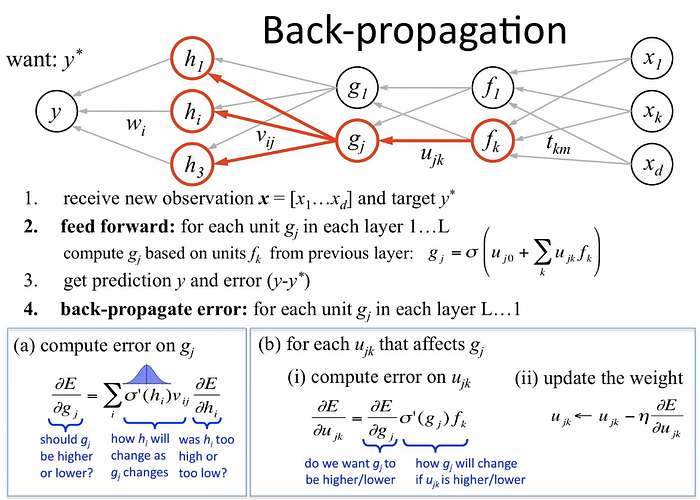

With the [USB framework](https://docs.pytorch.org/tutorials/advanced/usb_semisup_learn.html) (build on top of PyTorch), such algorithms can be used in a handful of lines of code:

```python
config = {
    'algorithm': 'freematch',
    'net': 'vit_tiny_patch2_32',
    'use_pretrain': True,
    'pretrain_path': 'https://github.com/microsoft/Semi-supervised-learning/releases/download/v.0.0.0/vit_tiny_patch2_32_mlp_im_1k_32.pth',

    # optimization configs
    'epoch': 1,
    'num_train_iter': 500,
    'num_eval_iter': 500,
    'num_log_iter': 50,
    'optim': 'AdamW',
    'lr': 5e-4,
    'layer_decay': 0.5,
    'batch_size': 16,
    'eval_batch_size': 16,


    # dataset configs
    'dataset': 'cifar10',
    'num_labels': 40,
    'num_classes': 10,
    'img_size': 32,
    'crop_ratio': 0.875,
    'data_dir': './data',
    'ulb_samples_per_class': None,

    # algorithm specific configs
    'hard_label': True,
    'T': 0.5,
    'ema_p': 0.999,
    'ent_loss_ratio': 0.001,
    'uratio': 2,
    'ulb_loss_ratio': 1.0,

    # device configs
    'gpu': 0,
    'world_size': 1,
    'distributed': False,
    "num_workers": 4,
}
config = get_config(config)

dataset_dict = get_dataset(config, config.algorithm, config.dataset, config.num_labels, config.num_classes, data_dir=config.data_dir, include_lb_to_ulb=config.include_lb_to_ulb)
train_lb_loader = get_data_loader(config, dataset_dict['train_lb'], config.batch_size)
train_ulb_loader = get_data_loader(config, dataset_dict['train_ulb'], int(config.batch_size * config.uratio))
eval_loader = get_data_loader(config, dataset_dict['eval'], config.eval_batch_size)
algorithm = get_algorithm(config,  get_net_builder(config.net, from_name=False), tb_log=None, logger=None)

# start training
trainer = Trainer(config, algorithm)
trainer.fit(train_lb_loader, train_ulb_loader, eval_loader)

#evaluate
trainer.evaluate(eval_loader)
```

<sup>[⌃ Go back to top ⌃](#contents)</sup>

---

## Quids - cuPy enabled microorganism simulation

As a random [embarrassingly parallel](https://en.wikipedia.org/wiki/Embarrassingly_parallel) example, simulation of fictional microorganisms, called Quids, was chosen and implemented with cuPy.

Similar to the classic Conway's Game of Life, the rules for their movement and reproduction can be described through matrix operations, as can their "world" - a 2D grid. The interactions between 4 types of Quids are expressed as a matrix as well, where 'x' means mate, '0' means ignore and '-' means fight.

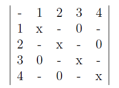

To get a bit closer to real microorganism systems, the grid had a global temperature parameter, as well as localized pockets of varying pH levels, and each type of quid has different preferences for each.

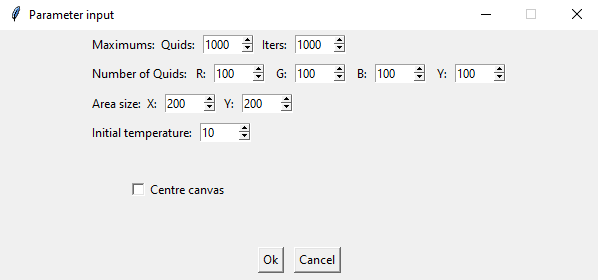

An optional GUI for controlling and visualizing the simulation was integrated into the scripts as well. The simulation can also be run in the background, and produced logs analyzed later.

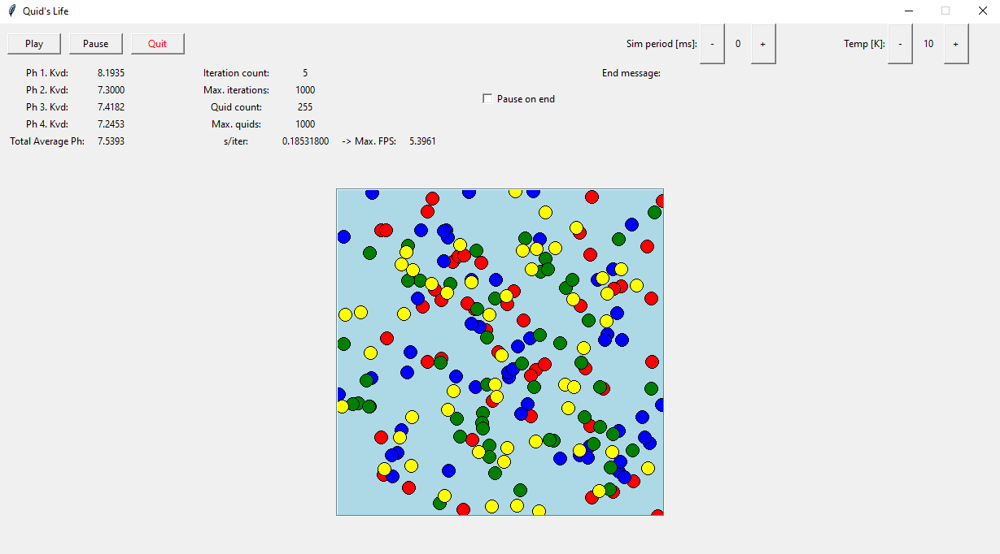

The simulation was implemented in 3 stages:

- first, a classic, sequential (single thread) CPU implementation

- then, grid update operations were vectorized with the help of Numpy

- next, GPU was used to carry out the parallel calculations. The lower-level PyCUDA module proved difficult to cleanly integrate into the existing solution, so [cuPy](https://massedcompute.com/faq-answers/?question=What%20are%20the%20key%20differences%20between%20cuPy%20and%20other%20CUDA%20libraries%20for%20Python?), a open-source module with an API similar to Numpy, was used instead.

- finally, performance differences between an Object Oriented and Data Oriented approach were explored

Details around the implementation can be found in the provided `quids_docs.pdf`. The main lesson was that working in a heterogeneous requires a well thought-out data model, and while modern GPU libraries can compile and run most things we might put in a kernel, the acceleration they provide might be less then what we hoped for.

- even if the core of an algorithm does not have inter-dependencies (speedup potential according to Amdahl's law), allowing it to be executed in parallel, to recoup the cost of offloading to the GPU and recovering the result, we need a sufficiently large input, relatively few conditionals in our logic (execution kernel), few serial bottlenecks etc. ([common GPU operations](https://en.wikipedia.org/wiki/General-purpose_computing_on_graphics_processing_units#GPU_methods)).

- Even satisfying those, due to implementation details of coprocessors, additional requirements are imposed due to limited arithmetic data type and operation support, memory size and bus speed limits, missed compiler optimization opportunities etc.

- And on top of that, there are vendor-specific implementation details, and device-specific parameters to be taken into account.

<sup>[⌃ Go back to top ⌃](#contents)</sup>
